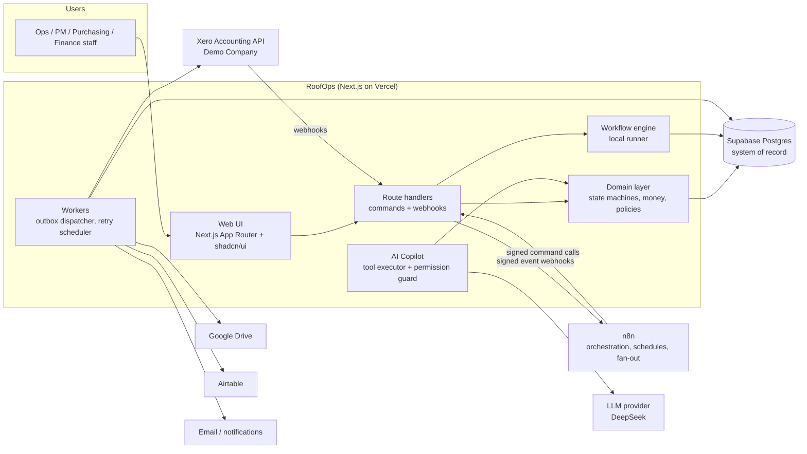
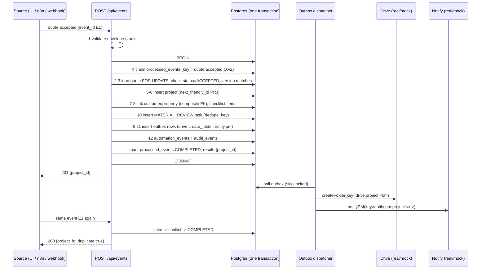
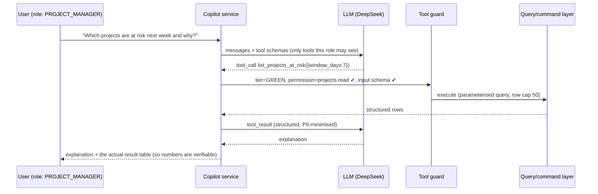

# RoofOps — Architecture

> **Status:** Phase 1 complete: database, canonical data import and operational views are implemented and tested (see [data-import.md](data-import.md)). Everything else here is design for later phases unless it says otherwise.
> Everything in RoofOps runs on **synthetic demo data**. No real customers, suppliers or companies.

## 1. What this system is

RoofOps is an internal operations platform for a fictional Australian roofing contractor. It covers the whole job lifecycle:

```
Lead → Customer → Property → Inspection → Estimate → Quote → Quote acceptance → Project
     → Material requirements → Purchase order → Supplier → Job scheduling → Field work
     → Photos/documents → Completion → Invoice → Payment → Reporting
```

It is built to show **how** a small business's operational automation should be designed. The UI matters less than the automation: what happens when a webhook arrives twice, when Xero rate-limits us, when an AI proposes a purchase order, or when a timeout leaves us unsure whether an invoice was created.

**Non-goals.** It is not a generic SaaS product, not a RAG chatbot, not a replacement for Xero or a job-management package, and it does not produce roofing estimates automatically.

## 2. Target architecture (confirmed after Phase 1)

| Layer | System | Role |
|---|---|---|
| Staff-facing operations | **Airtable** | where staff work day to day (quotes, projects, POs) |
| System / control layer | **Postgres (Supabase)** | idempotency ledger, audit trail, exception queue, derived risk, integration identities |
| Orchestration | **n8n** | webhooks, schedules, fan-out, write-back to Airtable |
| Accounting source of truth | **Xero** | invoices, payments, contacts |
| Document store | **Google Drive** | project folders, photos, PDFs |
| Conversational interface | **AI Copilot** | tool calling over the control layer (GREEN/AMBER/RED) |

First workflow (Phase 2): Airtable Quote Accepted → webhook/event → validation → Postgres idempotency check → create Project → create material-review task → Drive adapter → audit log → update Airtable.
First Xero workflow (Phase 6): project invoice-ready → n8n → validate → approval → Xero Demo Company → persist Xero InvoiceID → update internal invoice → audit/reconciliation.

The diagram below is the Phase 0 component view; the table above supersedes its "system of record" wording.

### Component view (Phase 0)



**Ownership rule:** every business invariant lives in one place, in the control layer. n8n orchestrates (triggers, schedules, fan-out, retries of *its* calls) but **never issues raw writes against business tables**. It invokes one guarded entry point per command: Postgres functions in Phase 2, and the same functions behind an HTTP API once the app exists (ADR-001). That keeps validation, idempotency and audit in one place.

## 3. Layers and code layout (planned)

```
src/
  app/                      Next.js routes (UI pages + /api route handlers)
  domain/                   Pure TypeScript, no I/O. Unit-tested exhaustively.
    money.ts                integer-cent arithmetic, GST, rounding rules
    state-machines/         quote, project, purchase-order, invoice transitions
    permissions.ts          role -> permission matrix
    risk.ts                 project risk rules (derived, not stored)
  application/              Commands/use-cases. Own transactions, idempotency, audit.
    commands/               acceptQuote, createProjectFromQuote, approvePo, ...
    queries/                read models used by UI and AI READ tools
  workflows/                Workflow definitions (steps, versions) + local runner
    quote-to-project/
    reliability/            retry policy, error classifier, backoff, reconciler
  integrations/             One folder per provider, each with real + mock
    xero/  drive/  airtable/  notify/  llm/
    fault-injection/        decorator that makes any mock fail on a script
  copilot/                  tool registry, tier guard, approval bridge, prompts
  infra/                    db client (server-only), config (zod-validated env), logger
  test/                     fixtures (webhook payloads, supplier quotes), factories
supabase/migrations/        SQL migrations (source of truth for schema)
n8n/                        Exported n8n workflow JSON, versioned with the code
scripts/                    seed, audits, one-off checks
docs/                       this folder
```

Dependency direction is strict: `app → application → domain`. `application → integrations` goes through interfaces only. `domain` imports nothing with side effects.

## 4. Integrations: real systems only

**There are no mock providers** (ADR-018). Every integration talks to the real service, or the capability is reported **BLOCKED**. Nothing is ever simulated as successful.

| Service | Role | Status (see docs/phase2-status.md) |
|---|---|---|
| Postgres 17, Supabase (Sydney) | control layer, live data | LIVE, loaded and verified |
| Airtable base "RoofOps Demo" | staff-facing operations | LIVE, 228 records loaded and read back |
| n8n Cloud (dedicated RoofOps workspace) | orchestration | BLOCKED: `N8N_BASE_URL` points at a shared workspace |
| Google Drive (tejesht08, `drive.file` scope) | document store | BLOCKED: no Google OAuth2 credential in n8n |
| Xero Demo Company | accounting source of truth | not started (Phase 5) |
| DeepSeek (`deepseek-flash`) | copilot LLM | not started (Phase 6) |

**Rules**
- **Create, then read back, then verify.** A side effect is recorded (`external_links.verified_at`) only after an independent read of the external system confirms it. `wf_complete_side_effect()` refuses results without `verified: true`.
- External identities are the system's own IDs (Airtable `rec…`, Drive file ID, Xero InvoiceID), never names.
- Secrets: `.env` / `.env.local` (gitignored), `secrets/` (gitignored) for generated credentials, and n8n Credentials for OAuth. Exported n8n workflow JSON references credentials by ID/name only.
- Failure testing uses real behaviour (e.g. a genuine client timeout, a real HTTP error from a real endpoint), not injected fake responses.

## 5. Events, audit, and why they are separate

| | `automation_events` | `audit_events` |
|---|---|---|
| Purpose | Debugging/operations: what did the machinery do? | Accountability: who changed what business record, and on whose authority? |
| Audience | Engineers, Automation Health page | Managers, finance, disputes |
| Mutability | Insert-only; may be archived after retention | **Append-only**, DB triggers reject UPDATE/DELETE/TRUNCATE, **hash-chained** |
| Contains | event_type, correlation/causation, status, error_class, payload | actor, action, before/after state, approval, external reference, reason |

### Event envelope (validated with zod at every boundary)

```jsonc
{
  "event_id": "uuid",               // unique per event occurrence
  "correlation_id": "uuid",         // ties the whole chain together (quote accepted -> ... -> invoice)
  "causation_id": "uuid|null",      // the event that caused this one
  "event_type": "quote.accepted",
  "entity_type": "quote", "entity_id": "uuid", "business_reference": "Q-2026-0042",
  "actor_type": "USER|SYSTEM|AI|INTEGRATION|WORKFLOW", "actor_id": "EMP-004",
  "source": "roofops-web", "workflow_version": "quote_to_project@1.0.0",
  "occurred_at": "2026-09-29T01:02:03Z",
  "status": "RECEIVED", "external_reference": null, "error_class": null,
  "metadata": {}, "payload": { "quote_id": "uuid", "accepted_version": 2 }
}
```

Event types: `quote.accepted`, `project.created`, `materials.review_requested`, `po.drafted`, `po.approved`, `po.sent`, `supplier.acknowledged`, `job.scheduled`, `job.completed`, `invoice.drafted`, `invoice.created`, `invoice.synced`, `payment.received`, `automation.failed`, `automation.retry_scheduled`, `webhook.duplicate_ignored`.

## 6. Module 1: Quote accepted → Project (the idempotency showcase)

### Two kinds of duplicate

1. **Transport duplicate:** the same webhook delivered twice (same `event_id`). Common with at-least-once delivery.
2. **Semantic duplicate:** two *different* events describing the same business fact. For example, a user double-clicks "Accept", or n8n and the UI both emit `quote.accepted`.

Deduplicating on `event_id` only handles case 1. RoofOps derives the idempotency key from the **business fact**:

```
idempotency_key = "quote.accepted:" + quote_id + ":v" + accepted_version_number
consumer        = "quote_to_project@1"
```

### Defence in depth

1. `processed_events` primary key `(consumer, idempotency_key)`: the claim.
2. `projects.quote_id UNIQUE`: even a bug that bypasses the claim cannot create a second project.
3. `tasks.dedupe_key UNIQUE`, `project_checklist_items (project_id, item_code) UNIQUE`, `outbox.idempotency_key UNIQUE`: every child write is individually idempotent.

### Claim algorithm

```sql
-- 1. try to claim
insert into processed_events (consumer, idempotency_key, first_event_id, request_hash, status, locked_by, lease_expires_at)
values ($consumer, $key, $event_id, $hash, 'PROCESSING', $worker, now() + interval '30 seconds')
on conflict do nothing
returning *;
```

- **Row returned** → we own it. Continue.
- **No row** → read the existing row:
  - `COMPLETED` → return the stored `result` (the original project ID). Log `webhook.duplicate_ignored`. HTTP 200.
  - `PROCESSING` and lease not expired → another worker is on it. HTTP 409 `in_progress`; the caller may retry later.
  - `PROCESSING` and lease expired (the worker crashed) → take over with
    `update ... set locked_by=$me, lease_expires_at=..., attempt_count=attempt_count+1 where ... and lease_expires_at < now() returning *`. Only one taker can win.
  - `request_hash` differs → same key, different payload → **reject** (`VALIDATION_ERROR`, not retried). This mirrors how Xero treats reused idempotency keys.

### Transaction boundary



External side effects (steps 9 and 11) never happen inside the database transaction. If the transaction rolls back, no folder exists. If the folder call fails, the project still exists and the outbox retries with the same key.

The seeded scenario "accepted quote where project creation failed" (Q-2026-0031) is this workflow stopped at an open `workflow_exceptions` row. Pressing **RETRY** re-runs it under the same idempotency key.

## 7. Reliability policy (Module 3)

### Error classification → behaviour

| Error class | Example | Retry? | Policy |
|---|---|---|---|
| `VALIDATION_ERROR` | invalid JSON, missing field, bad enum | **No** | Exception queue immediately. Retrying the same bad input cannot succeed. |
| `NOT_FOUND` | quote does not exist | No | Exception queue |
| `INVALID_STATE` | quote not ACCEPTED, PO already SENT | No | Exception queue (or no-op if already in the target state) |
| `PERMISSION_DENIED` | role lacks permission | No | Reject; audit the attempt |
| `CONFLICT` | optimistic-lock mismatch (`record_version`) | Once, after re-read | Re-validate, then decide |
| `RATE_LIMITED` | HTTP 429 | Yes | Wait `Retry-After` if present, else exponential backoff |
| `UPSTREAM_5XX` | HTTP 500/502/503 | Yes, bounded | Exponential backoff with full jitter, max 5 attempts |
| `TIMEOUT` / `NETWORK` on **read/idempotent** call | GET timed out | Yes, bounded | as 5XX |
| `AMBIGUOUS_WRITE` | POST timed out; we don't know if it committed | **Not blindly** | **Reconcile first**: query external state by our reference. Found → record it, done. Not found → retry with the same key if the key is still valid, else a new key. |
| `SERVICE_UNAVAILABLE` | circuit open / provider down | Yes, deferred | Park the run; circuit breaker half-opens after cool-down |

Backoff: `delay = min(cap, base × 2^(attempt−1))`, then full jitter `random(0, delay)`. Defaults: base 1 s, cap 60 s, max 5 attempts. A `Retry-After` header overrides the computed delay. Randomness is seeded in tests so the delays are deterministic. For live demos, `RETRY_TIME_SCALE=0.05` compresses real waits while the UI shows the nominal delays.

After max attempts, or on any non-retryable error, the run becomes `DEAD_LETTERED` and a `workflow_exceptions` row is opened (at most one open per run, enforced by a partial unique index).

### Exception queue actions

- **RETRY**: sets the exception to `RETRY_QUEUED` and re-queues the *same* `workflow_run` with the *same* idempotency key. Pressing it twice cannot fork the run.
- **MARK RESOLVED**: requires a note; records who resolved it; audited.
- **VIEW EVENT**: opens the triggering event, the step timeline (`workflow_run_steps`, including every backoff decision) and the correlated audit chain.

### Why ambiguous writes matter here (verified against Xero docs, 2026-09-29)

Xero supports an `Idempotency-Key` header on POST/PUT/PATCH, but **keys are only stored for 6 minutes**. After that, the same key is processed as new. Xero also caches *errors* against a key. So a retry 10 minutes after a timed-out invoice POST, with the "same" key, can create a duplicate invoice. RoofOps therefore:

1. sends `Idempotency-Key` for fast retries (under 6 minutes);
2. writes our own invoice number into Xero's `Reference` and `InvoiceNumber`, so we can look the invoice up;
3. on `AMBIGUOUS_WRITE`, or on any retry older than 5 minutes, **GETs first** and only POSTs if nothing is found;
4. persists Xero's `InvoiceID` in `external_links` (unique per provider + external ID), never matching on names.

Source: https://developer.xero.com/documentation/guides/idempotent-requests/idempotency/

### Provider limits that shape the retry policy (from official docs)

| Provider | Limit | Our handling |
|---|---|---|
| Xero | 60 calls/min per tenant, 5 concurrent, 1,000/day (starter) or 5,000/day; 429 + `Retry-After` + `X-Rate-Limit-Problem` | per-tenant token bucket; batch invoices where possible; honour `Retry-After` |
| Airtable | 5 req/s per base; 429 → must wait 30 s | queue with 4 req/s cap; 30 s floor on 429 |
| Google Drive | per-user quotas; 403 `rateLimitExceeded` / 429 | backoff; folder creation reconciled by searching `appProperties.roofopsProjectId` |

Sources: https://developer.xero.com/documentation/guides/oauth2/limits/ · https://airtable.com/developers/web/api/rate-limits · Drive details to be confirmed against official docs in Phase 2 before the real adapter is written.

### Automation Health metrics (definitions, computed from `workflow_runs`)

- **Last run:** max(`started_at`) per `workflow_key`
- **Status:** status of the latest run
- **Duration:** p50/p95 of `finished_at − started_at` over the last 7 days
- **Failure rate:** runs ending `FAILED`/`DEAD_LETTERED` ÷ finished runs, last 7 days
- **Retry count:** Σ(`attempt_count − 1`), last 7 days
- **Exception count:** open `workflow_exceptions`

## 8. AI Operations Copilot (Module 2)

### Principle

The model chooses **which** tool to call and explains the results. **Code** executes queries, validates input, checks permissions, does arithmetic and performs writes. The model never receives database credentials, SQL access or raw tables.



### Tool tiers

| Tier | Examples | What happens | Side effects |
|---|---|---|---|
| **GREEN, read** | `get_project`, `find_customer`, `list_delayed_projects`, `list_projects_waiting_on_materials`, `get_quote_conversion`, `get_supplier_spend`, `get_overdue_invoices`, `get_project_timeline`, `get_purchase_order`, `list_workflow_exceptions` | Runs automatically if the user's role has the permission | None |
| **AMBER, draft** | `draft_purchase_order`, `draft_supplier_email`, `draft_customer_message`, `draft_project_summary` | Creates an internal draft (`ai_drafts`, or a PO in `DRAFT` with `origin='AI_DRAFT'`) | Internal only. Nothing leaves the building. |
| **RED, action** | `send_purchase_order`, `create_invoice`, `cancel_project`, `change_approved_materials` | The model can only **request**. This creates an `approvals` row in `PENDING`. | None until a human approves |

### RED action protocol (all seven requirements)

1. **Permission check:** the role of the human the AI acts for must hold `required_permission`. Otherwise `DENIED_PERMISSION` is logged and no approval is created.
2. **Schema validation:** the tool input is parsed with zod into a typed command. Free text never becomes an amount: amounts are recomputed by code from referenced records (PO lines, invoice lines).
3. **Current-state validation:** the target must be in an allowed state (for example PO `APPROVED` before `SEND`). The approval stores `expected_record_version`.
4. **Explicit human confirmation:** an authenticated user clicks Approve or Reject in the Approvals UI. There is **no tool** the model can call to approve. The approver sees the exact structured payload, and `payload_hash` binds the decision to that payload.
5. **Idempotency key:** stored on the approval (`UNIQUE`) and passed through to the command and any external call.
6. **Audit event:** request, decision and execution are each audited, with `on_behalf_of` and `approval_id`.
7. **Execution result:** stored on the approval (`EXECUTED` / `EXECUTION_FAILED` + `execution_result`).

At execution time the target is re-read. If `record_version ≠ expected_record_version` (for example someone edited a PO line after approval; the schema bumps the PO version when lines change), execution is refused as stale.

### Prompt-injection stance

Site notes, supplier emails and supplier quote text are **untrusted data**. They reach the model only as tool results, clearly delimited. Even a successful injection can at most cause a GREEN read (already permitted for that user) or create a PENDING approval that a human must review. It cannot move money or send anything.

### Provider abstraction

Real DeepSeek (`DEEPSEEK_MODEL`, OpenAI-compatible API, server-side only) behind a thin `LlmClient`; if the API is unavailable the copilot reports it rather than answering. Every call is logged to `ai_tool_invocations` (tool, tier, input, decision, latency).

## 9. Supplier quote → PO (Module 4) data flow

```
supplier quote file (PDF/CSV/email text; 6 deliberately inconsistent fixtures)
  → LLM structured extraction (JSON schema)             — AI: extraction only
  → zod validation (missing fields → validation_issues, status NEEDS_REVIEW)
  → normalisation in code: GST-inclusive → ex-GST, unit conversion, freight found in notes
  → product matching: supplier SKU → alias exact → fuzzy suggestion (human confirms)
  → deterministic arithmetic: recompute every line; compare with stated totals;
    flag mismatch (e.g. quantity × price ≠ stated line total)
  → comparison: lowest landed cost · fastest delivery · best option meeting required_by
  → human review (Purchasing)
  → draft PO (status DRAFT, origin SUPPLIER_QUOTE)       — never auto-issued
```

The model's JSON is stored verbatim (`supplier_quotes.extraction`) beside the code-computed values, so any disagreement is visible.

## 10. Security

- **Authentication:** Supabase Auth in real mode. In demo mode, a clearly labelled **role switcher** lets the presenter show the same action allowed for FINANCE and denied for FIELD_CREW.
- **Authorisation:** permission matrix in code (`domain/permissions.ts`), unit-tested. Every command checks it; the copilot filters tool schemas by it *and* re-checks at execution.
- **Database access:** RLS enabled on every table with no policies, so browsers can't query tables directly. Server code uses a server-only connection. The Supabase `service_role` key is never exposed to the client (`server-only` import guard).
- **Webhooks:** HMAC-SHA256 signature over `timestamp + body`, a 5-minute replay window, constant-time comparison. The Xero webhook uses Xero's `x-xero-signature` scheme (to be verified in Phase 6).
- **Secrets:** environment variables only (`.env.example` lists them; zod validates them at boot). No secrets in n8n workflow exports (credentials are referenced by name).
- **PII to LLM:** tool results are trimmed to the fields needed. Phone numbers and emails are omitted unless the tool is specifically about contact details.

### Role → permission matrix (initial)

| Permission | ADMIN | OPS_MGR | PM | ESTIMATOR | PURCHASING | FINANCE | FIELD_CREW | VIEWER |
|---|---|---|---|---|---|---|---|---|
| projects.read | ✔ | ✔ | ✔ | ✔ | ✔ | ✔ | own jobs | ✔ |
| quotes.accept | ✔ | ✔ | | ✔ | | | | |
| materials.approve | ✔ | ✔ | ✔ | | ✔ | | | |
| po.draft | ✔ | ✔ | ✔ | | ✔ | | | |
| po.approve / po.send | ✔ | ✔ | | | ✔ | | | |
| invoice.create / invoice.sync | ✔ | | | | | ✔ | | |
| project.cancel | ✔ | ✔ | | | | | | |
| exceptions.resolve | ✔ | ✔ | | | | | | |
| audit.read | ✔ | ✔ | | | | ✔ | | |

## 11. n8n's role

n8n is the **orchestrator**, not the database. Workflows live in `n8n/*.json`, exported and versioned with the code.

| Workflow | Trigger | What n8n does | What RoofOps does |
|---|---|---|---|
| quote-accepted fan-out | RoofOps outbound webhook | Calls `POST /api/commands/create-project-from-quote` with event + signature | Everything in §6 |
| supplier acknowledgement chaser | Schedule (daily 7am AEST) | Calls `GET /api/queries/po-awaiting-ack`, sends reminder drafts for approval | Query + drafts |
| overdue invoice digest | Schedule (Mon 8am) | Calls query endpoint, emails digest to Finance | Query |
| Drive folder / Airtable mirror | Outbox topic webhook | Calls Google/Airtable nodes, posts result back to `/api/callbacks/...` | Records `external_links`, audits |

`WORKFLOW_RUNNER=local` executes the same step definitions in-process, so the demo does not depend on n8n being up. The UI states which runner handled each run (`workflow_runs.runner`).

## 12. Airtable's role

Airtable is the **staff-facing operations layer** (ADR-006). Staff act in Airtable; those actions arrive as events; Postgres enforces what Airtable cannot (uniqueness, idempotency, append-only audit, exception handling) and n8n writes outcomes back. Airtable records are linked through `external_links` (provider AIRTABLE) by Airtable record ID, never by name. Airtable's limit is 5 requests per second per base, and a 429 needs a 30-second wait, so write-backs are queued and rate-capped. Nothing has been uploaded to Airtable yet.

## 13. Testing strategy

| Layer | Tool | Database |
|---|---|---|
| Domain (state machines, money, permissions, risk, backoff) | Vitest unit | none |
| Import, schema constraints, views, idempotency, audit | Vitest integration | **PGlite** (in-process Postgres 18) always; **real Postgres 17** too when `TEST_DATABASE_URL` is set (throwaway database per test). Implemented in Phase 1: 124 tests pass on both engines. |
| True concurrency (two workers, same event) | Vitest integration | **Real Postgres** via Docker (Supabase local). PGlite has a single connection and would make the race test meaningless. |
| Integrations | End-to-end tests against the real services: create, then read back, then verify (Airtable API, Drive files.get, Xero GET Invoices, n8n executions API) | hosted |
| Demo path | Playwright | seeded DB |

The Phase 0 constraint script became `test/schema.test.ts` in Phase 1.

## 14. Deployment and safe change

- **Environments:** local (PGlite/Supabase local + all mocks) → preview (Vercel preview + Supabase branch + mocks) → demo (Vercel + Supabase + Xero Demo Company).
- **Migrations:** forward-only SQL via Supabase CLI. Breaking changes use expand → migrate → contract.
- **Workflow versioning:** `workflow_version` is stamped on every run and event. In-flight runs finish on the version they started with.
- **Kill switches:** `AUTOMATION_PAUSED=true` stops outbox dispatch and workflow execution without rejecting inbound events (they queue). `AI_ACTIONS_ENABLED=false` hides AMBER/RED tools.
- **CI gate:** lint, typecheck, unit + integration tests, migration applies cleanly to an empty DB, Playwright smoke test.

## 15. What could fail in production (known risks)

1. **Clock skew between n8n and RoofOps** can break the webhook replay window. Mitigation: 5-minute tolerance and NTP.
2. **Lease too short** on a slow external call → a second worker takes over mid-flight. Mitigation: external calls happen via the outbox, outside the lease; the lease only covers the DB transaction.
3. **Audit hash-chain advisory lock** serialises audit writes. Fine at SMB volume, but a bottleneck at high write rates.
4. **Xero 6-minute idempotency window** (see §7). Mitigated by reconcile-before-retry, but a reconcile query can itself be rate-limited.
5. **Supplier quote extraction** will sometimes be wrong. Mitigated by schema validation, arithmetic cross-checks and mandatory human review, not by trusting the model.
6. **Real-service drift:** vendors change APIs, scopes and limits (e.g. Xero's granular scopes since March 2026, Airtable's free-plan limit of 1,000 calls a month). Mitigated by read-back verification on every side effect and by E2E tests run against the live services before each demo.
7. **Friendly ID gaps** appear when transactions roll back. That is acceptable, and documented for the accountants.
