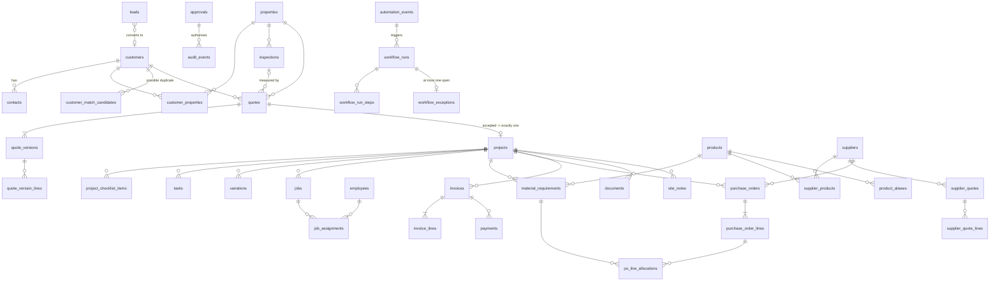

# RoofOps — Data model

Source of truth: [`supabase/migrations/20260929000000_core_schema.sql`](../supabase/migrations/20260929000000_core_schema.sql)
Verified (Phase 1): applied to **Postgres 17** and PGlite (Postgres 18): 48 public tables (the 44 designed in Phase 0, plus `app_settings`, `error_classes`, `import_batches` and `schema_migrations`), 10 views and 14 staging tables. Constraint suite: `test/schema.test.ts`.

**Phase 1 amendments (ADR-014):** business dates are `date` columns (`customer_since`, `quotes.created_on/sent_on/accepted_on`, `po_date`), and `created_at` always means row insertion. Each quote version, PO and invoice has `line_amount_type` (EXCLUSIVE/INCLUSIVE/NO_TAX, ADR-013); lines use `unit_price` and `line_amount`, and freight is a line (`line_kind = FREIGHT`). Source-ID columns were added (`product_code`, `document_number`, `note_number`, `automation_events.event_key`). `record_origin` marks imported legacy rows (ADR-015). Error classes moved from CHECK lists to an `error_classes` reference table carrying the retry policy. There is a `stable_uuid()` for deterministic keys and an `app_today()` business date, accepted quote versions are frozen, and `verify_audit_chain()` recomputes the audit hashes.

## Entity–relationship overview

## Tables by group (44)

| Group | Tables |
|---|---|
| People & parties | `employees`, `customers`, `contacts`, `customer_match_candidates`, `leads` |
| Property & inspection | `properties`, `customer_properties` (M:N), `inspections` |
| Sales | `quotes`, `quote_versions`, `quote_version_lines` |
| Delivery | `projects`, `project_checklist_items`, `tasks`, `variations`, `jobs`, `job_assignments` (M:N) |
| Purchasing | `suppliers`, `products`, `product_aliases`, `supplier_products` (M:N + price), `material_requirements`, `supplier_quotes`, `supplier_quote_lines`, `purchase_orders`, `purchase_order_lines`, `po_line_allocations` (M:N) |
| Finance | `invoices`, `invoice_lines`, `payments` |
| Field records | `documents`, `site_notes` |
| Integration identity | `external_links` |
| Automation | `automation_events`, `processed_events`, `workflow_runs`, `workflow_run_steps`, `workflow_exceptions`, `outbox` |
| Control | `approvals`, `audit_events`, `ai_tool_invocations`, `ai_drafts` |
| Support | `id_counters` |

This covers all 25 required entities, plus 19 supporting tables. Each supporting table exists for a specific reason:

- `customer_properties`: an owner, a tenant and a property manager can all relate to one property, and a builder relates to many properties.
- `po_line_allocations`: one PO line can serve several projects' requirements (a consolidated order), and one requirement can be split across suppliers.
- `variations`: Module 5 must "validate approved variations" before invoicing. The source CSV shows two projects invoiced 20% above the quote with nothing to justify it.
- `outbox`: external side effects must not happen inside a DB transaction (see architecture §6).
- `workflow_run_steps`: the Automation Health page needs a per-step timeline, including every backoff decision.
- `external_links`: one uniform, uniquely constrained place for Xero, Drive and Airtable IDs, with `is_mock`.

## Integrity rules enforced by the database (not just the app)

| Rule | Mechanism |
|---|---|
| One project per quote | `projects.quote_id UNIQUE` |
| Project's customer/property = its quote's | composite FK `(quote_id, customer_id, property_id) → quotes` |
| Project's accepted version belongs to that quote | composite FK `(accepted_quote_version_id, quote_id) → quote_versions(id, quote_id)` |
| Quote is ACCEPTED ⇔ it has an accepted version and a timestamp | CHECK |
| GST and totals are arithmetically correct | CHECK on `quote_versions`; PO/invoice header totals **derived by trigger** from GENERATED line totals. Forged values are overwritten. |
| Editing a PO line invalidates prior approval | line change bumps the header `record_version`; approvals carry `expected_record_version` |
| PO can't be SENT without approval; invoice can't be ISSUED without approval | CHECK on `approved_by`/`approved_at` by status |
| Duplicate PO / invoice creation | `idempotency_key UNIQUE` |
| One Xero ID ↔ one internal record | `external_links UNIQUE (provider, external_type, external_id)` |
| Site note's job belongs to the note's project | composite FK `(job_id, project_id) → jobs(id, project_id)` |
| Documents always attached to something | `CHECK num_nonnulls(...) >= 1` with real FKs (no polymorphic IDs) |
| At most one open exception per workflow run | partial unique index |
| AI-requested approval must be traceable to a tool call | CHECK `requested_by_actor_type <> 'AI' or requested_via_invocation_id is not null` |
| Rejections must give a reason | CHECK |
| Audit trail is append-only and tamper-evident | triggers reject UPDATE/DELETE/TRUNCATE; SHA-256 hash chain |

## Derived, never stored

These are computed in views (Phase 1) so they can't drift out of date. The CSV shows exactly that problem: stored `schedule_risk` = Low on projects months past their planned completion.

| Fact | Rule (initial) |
|---|---|
| `schedule_risk` | HIGH if: not complete and `planned_completion_date < today`; **or** earliest material ETA > `planned_start_date`; **or** a PO for the project is `SENT` and unacknowledged > 2 business days before start. MEDIUM if start ≤ 7 days away and any requirement is not `ORDERED`. |
| overdue invoice | status `ISSUED`/`PARTIALLY_PAID`, `due_date < today`, outstanding > 0 |
| outstanding | `total_inc_gst − Σ payments` |
| quote conversion | accepted ÷ (accepted + lost + expired), by period and by lead source |
| open PO value | Σ `total_inc_gst` where status in APPROVED…PARTIALLY_DELIVERED |
| missing completion docs | project COMPLETED and any required `COMPLETION` checklist item not DONE/WAIVED |

## State machines (enforced in `domain/state-machines`, tested for every invalid transition)

**Quote:** `DRAFT → SENT → ACCEPTED | LOST | EXPIRED`; `SENT → SENT` (new version). ACCEPTED is terminal. A change after acceptance becomes a *variation* on the project.

**Project:** `PLANNING → MATERIALS_PENDING → SCHEDULED → IN_PROGRESS → COMPLETED → CLOSED`; any non-terminal state → `ON_HOLD` (needs a reason) → back; any state before COMPLETED → `CANCELLED` (RED action, needs a reason).
COMPLETED requires every required COMPLETION checklist item to be DONE or WAIVED.

**Purchase order:** `DRAFT → PENDING_APPROVAL → APPROVED → SENT → ACKNOWLEDGED → PARTIALLY_DELIVERED → DELIVERED`; `DRAFT|PENDING_APPROVAL|APPROVED → CANCELLED`. SEND is a RED action.

**Invoice (business):** `DRAFT → PENDING_APPROVAL → APPROVED → ISSUED → PARTIALLY_PAID → PAID`; `VOIDED` from any state before PAID.
**Invoice (sync, independent):** `NOT_SYNCED → PENDING → SYNCED | FAILED | UNKNOWN`. `UNKNOWN` (ambiguous write) → reconcile → `SYNCED` or `FAILED`.

## Friendly IDs

Issued by `next_friendly_id(prefix, year)` using a row-locked counter. Formats: `CUST-0001`, `PROP-0001`, `SUP-001`, `LEAD-2026-0001`, `INS-2026-0001`, `Q-2026-0042`, `PRJ-2026-0018`, `JOB-2026-0001`, `PO-2026-0031`, `INV-2026-0012`, `VAR-2026-0001`, `APR-2026-0001`, `EXC-2026-0001`. They are unique but **not gapless** (a rolled-back transaction consumes a number). This is documented for finance. Xero issues its own invoice numbers if gapless numbering is required.

## Money

- Stored as `numeric(12,2)` AUD. In TypeScript, money is handled as integer cents (never floats).
- GST 10%, rounded half-away-from-zero to the cent: on the quote/invoice subtotal, and on PO (subtotal + freight).
- Xero may calculate tax per line rather than on the total. **Unverified:** confirm against the Xero Invoices docs in Phase 6. If it does, reconciliation will tolerate a difference of up to 1 cent × number of lines and record it, rather than failing.
