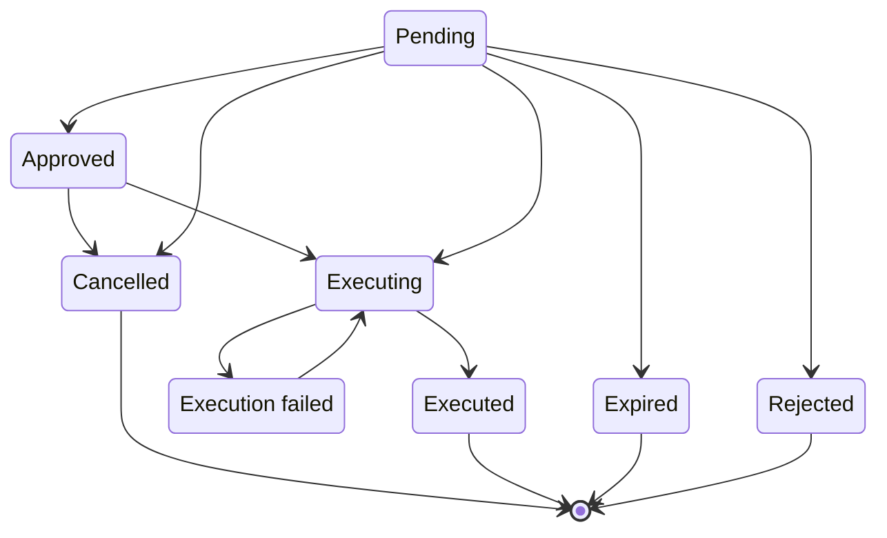
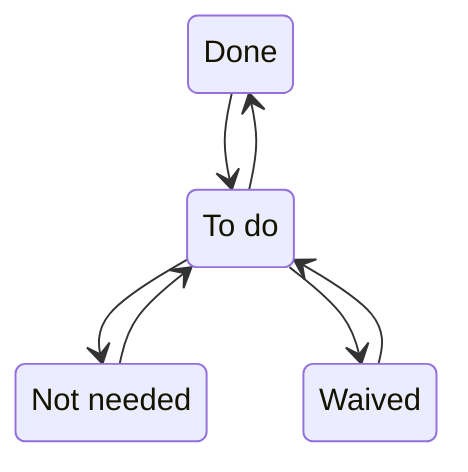
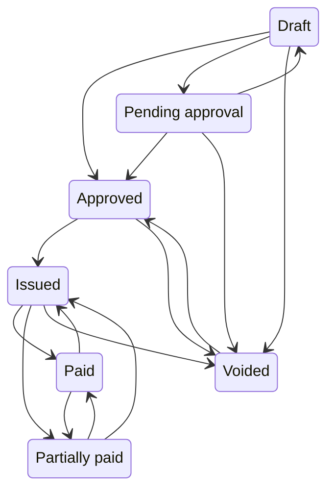
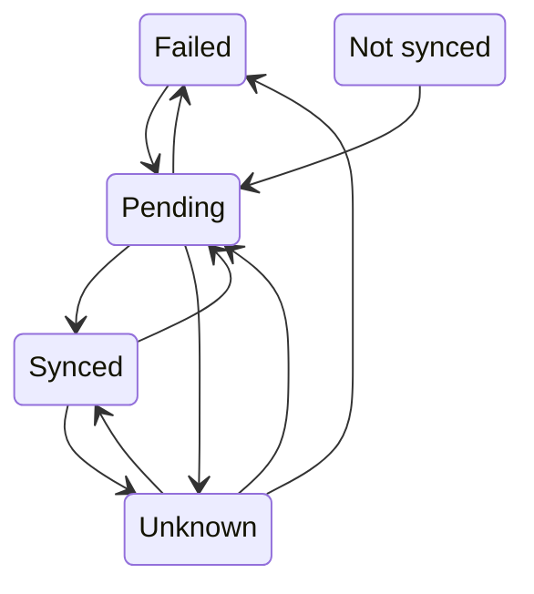
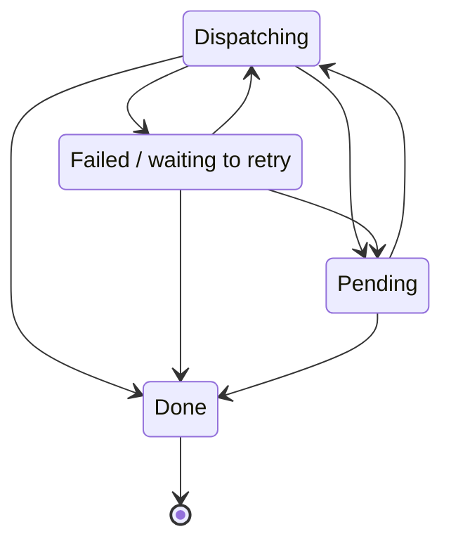
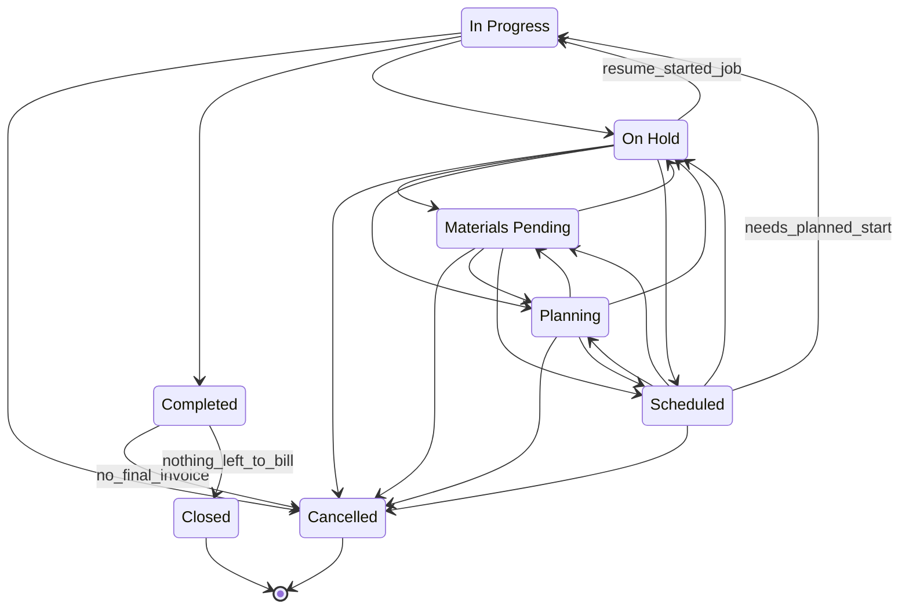
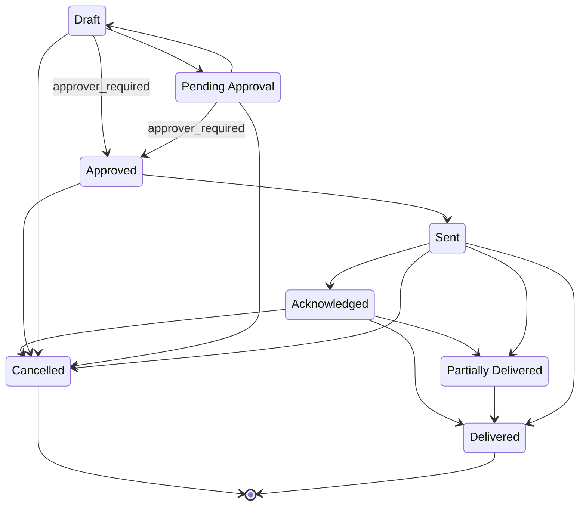
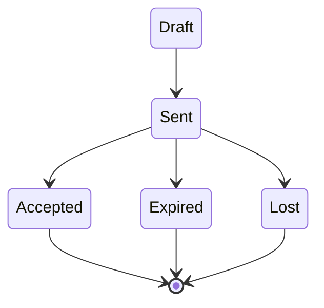
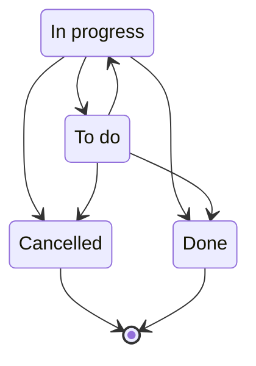
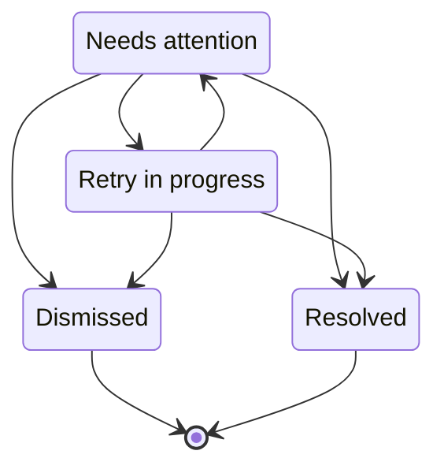

# State machines

Generated by `npm run contract:export` from `state_machine_states` / `state_transitions`. These rows are the single definition: the
`enforce_state_machine()` trigger refuses any other status change on the real tables (even from SQL that bypasses the application),
`project_transition_guard()` adds the business guards, and `test/state-integrity.test.ts` generates every (from, to) pair from them.

## approval

Terminal: CANCELLED, EXECUTED, EXPIRED, REJECTED. Every pair not listed below is refused (46 of 56 possible changes).

| From | To | Guard | Note |
|---|---|---|---|
| APPROVED | CANCELLED | — | — |
| APPROVED | EXECUTING | — | — |
| EXECUTING | EXECUTED | — | only with read-back proof |
| EXECUTING | EXECUTION_FAILED | — | — |
| EXECUTION_FAILED | EXECUTING | — | operator retry |
| PENDING | APPROVED | — | — |
| PENDING | CANCELLED | — | stale preview, project cancelled, or demo reset |
| PENDING | EXECUTING | — | approved and queued |
| PENDING | EXPIRED | — | — |
| PENDING | REJECTED | — | — |

## checklist_item

Terminal: none. Every pair not listed below is refused (6 of 12 possible changes).

| From | To | Guard | Note |
|---|---|---|---|
| DONE | OPEN | — | undo |
| NOT_APPLICABLE | OPEN | — | undo |
| OPEN | DONE | — | — |
| OPEN | NOT_APPLICABLE | — | — |
| OPEN | WAIVED | — | — |
| WAIVED | OPEN | — | undo |

## invoice

Terminal: none. Every pair not listed below is refused (26 of 42 possible changes).

| From | To | Guard | Note |
|---|---|---|---|
| APPROVED | ISSUED | — | — |
| APPROVED | VOIDED | — | — |
| DRAFT | APPROVED | — | — |
| DRAFT | PENDING_APPROVAL | — | — |
| DRAFT | VOIDED | — | — |
| ISSUED | PAID | — | — |
| ISSUED | PARTIALLY_PAID | — | — |
| ISSUED | VOIDED | — | — |
| PAID | ISSUED | — | Xero verified a payment was reversed (AC-14) |
| PAID | PARTIALLY_PAID | — | Xero verified a payment was reversed (AC-14) |
| PARTIALLY_PAID | ISSUED | — | Xero verified a payment was reversed (AC-14) |
| PARTIALLY_PAID | PAID | — | — |
| PENDING_APPROVAL | APPROVED | — | — |
| PENDING_APPROVAL | DRAFT | — | — |
| PENDING_APPROVAL | VOIDED | — | — |
| VOIDED | APPROVED | — | AC-14C B2: supervised reissue only - invoice_reissue_guard() refuses it without a matching REISSUE_INVOICE approval, the void proof and no money movement |

## invoice_sync

Terminal: none. Every pair not listed below is refused (10 of 20 possible changes).

| From | To | Guard | Note |
|---|---|---|---|
| FAILED | PENDING | — | operator re-queue |
| NOT_SYNCED | PENDING | — | — |
| PENDING | FAILED | — | — |
| PENDING | SYNCED | — | only with read-back proof |
| PENDING | UNKNOWN | — | — |
| SYNCED | PENDING | — | AC-14C B2: the reissue queues a new generation for the same invoice row, so its sync state is pending again |
| SYNCED | UNKNOWN | — | reconciliation found the Xero object changed or missing |
| UNKNOWN | FAILED | — | — |
| UNKNOWN | PENDING | — | — |
| UNKNOWN | SYNCED | — | only with read-back proof |

## outbox

Terminal: DONE. Every pair not listed below is refused (4 of 12 possible changes).

| From | To | Guard | Note |
|---|---|---|---|
| DISPATCHING | DONE | — | only with read-back proof |
| DISPATCHING | FAILED | — | — |
| DISPATCHING | PENDING | — | — |
| FAILED | DISPATCHING | — | retry after backoff |
| FAILED | DONE | — | reconciliation proved the Xero draft exists (AC-04) |
| FAILED | PENDING | — | operator re-queue |
| PENDING | DISPATCHING | — | — |
| PENDING | DONE | — | reconciliation proved the Xero draft exists (AC-04) |

## project

Terminal: CANCELLED, CLOSED. Every pair not listed below is refused (33 of 56 possible changes).

| From | To | Guard | Note |
|---|---|---|---|
| COMPLETED | CANCELLED | no_final_invoice | only while no final invoice exists; pending previews are withdrawn |
| COMPLETED | CLOSED | nothing_left_to_bill | only when every invoice is paid and the final invoice has been raised |
| IN_PROGRESS | CANCELLED | — | mid-job termination; historical invoices are kept |
| IN_PROGRESS | COMPLETED | — | sets Actual Completion = business date if blank |
| IN_PROGRESS | ON_HOLD | — | — |
| MATERIALS_PENDING | CANCELLED | — | — |
| MATERIALS_PENDING | ON_HOLD | — | — |
| MATERIALS_PENDING | PLANNING | — | — |
| MATERIALS_PENDING | SCHEDULED | — | — |
| ON_HOLD | CANCELLED | — | — |
| ON_HOLD | IN_PROGRESS | resume_started_job | only for a job that had already started |
| ON_HOLD | MATERIALS_PENDING | — | — |
| ON_HOLD | PLANNING | — | — |
| ON_HOLD | SCHEDULED | — | — |
| PLANNING | CANCELLED | — | needs a reason (default supplied) |
| PLANNING | MATERIALS_PENDING | — | — |
| PLANNING | ON_HOLD | — | needs a reason (default supplied) |
| PLANNING | SCHEDULED | — | — |
| SCHEDULED | CANCELLED | — | — |
| SCHEDULED | IN_PROGRESS | needs_planned_start | sets Actual Start = business date if blank |
| SCHEDULED | MATERIALS_PENDING | — | — |
| SCHEDULED | ON_HOLD | — | — |
| SCHEDULED | PLANNING | — | re-plan |

## purchase_order

Terminal: CANCELLED, DELIVERED. Every pair not listed below is refused (40 of 56 possible changes).

| From | To | Guard | Note |
|---|---|---|---|
| ACKNOWLEDGED | CANCELLED | — | — |
| ACKNOWLEDGED | DELIVERED | — | — |
| ACKNOWLEDGED | PARTIALLY_DELIVERED | — | — |
| APPROVED | CANCELLED | — | — |
| APPROVED | SENT | — | sets Sent timestamp |
| DRAFT | APPROVED | approver_required | — |
| DRAFT | CANCELLED | — | — |
| DRAFT | PENDING_APPROVAL | — | — |
| PARTIALLY_DELIVERED | DELIVERED | — | — |
| PENDING_APPROVAL | APPROVED | approver_required | — |
| PENDING_APPROVAL | CANCELLED | — | — |
| PENDING_APPROVAL | DRAFT | — | sent back for changes |
| SENT | ACKNOWLEDGED | — | supplier confirmed; sets Acknowledged timestamp |
| SENT | CANCELLED | — | — |
| SENT | DELIVERED | — | — |
| SENT | PARTIALLY_DELIVERED | — | — |

## quote

Terminal: ACCEPTED, EXPIRED, LOST. Every pair not listed below is refused (16 of 20 possible changes).

| From | To | Guard | Note |
|---|---|---|---|
| DRAFT | SENT | — | sets Sent On = business date if blank |
| SENT | ACCEPTED | — | Quote Accepted → Project workflow only |
| SENT | EXPIRED | — | — |
| SENT | LOST | — | needs a lost reason (default supplied) |

## task

Terminal: CANCELLED, DONE. Every pair not listed below is refused (6 of 12 possible changes).

| From | To | Guard | Note |
|---|---|---|---|
| IN_PROGRESS | CANCELLED | — | — |
| IN_PROGRESS | DONE | — | — |
| IN_PROGRESS | OPEN | — | — |
| OPEN | CANCELLED | — | — |
| OPEN | DONE | — | — |
| OPEN | IN_PROGRESS | — | — |

## workflow_exception

Terminal: IGNORED, RESOLVED. Every pair not listed below is refused (6 of 12 possible changes).

| From | To | Guard | Note |
|---|---|---|---|
| OPEN | IGNORED | — | — |
| OPEN | RESOLVED | — | — |
| OPEN | RETRY_QUEUED | — | — |
| RETRY_QUEUED | IGNORED | — | — |
| RETRY_QUEUED | OPEN | — | retry failed again |
| RETRY_QUEUED | RESOLVED | — | — |
